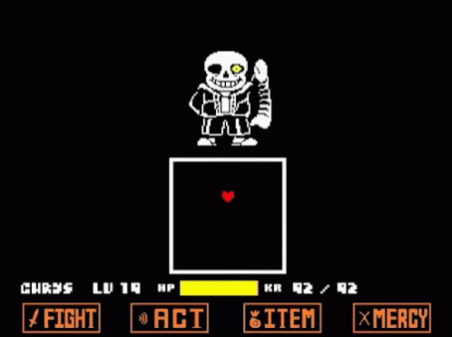
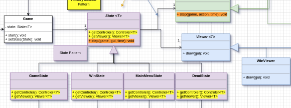
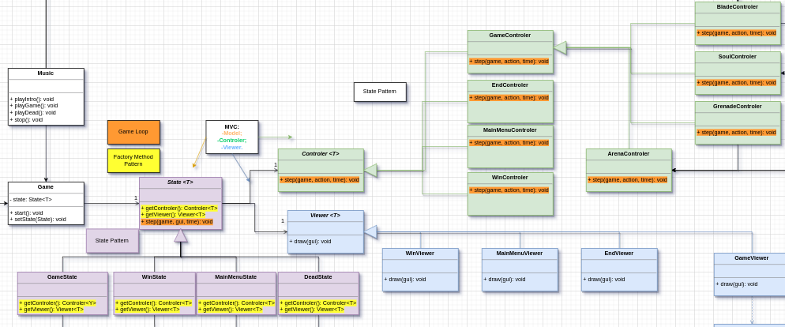
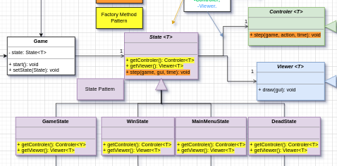

# 
LDTS - Soul's Duel

## 
project-l14gr09

This project was developed by *João Rey*(up202205576@fe.up.pt) and *Antero Morgado*(up202204971@fe.up.pt) for the curricular unity LDTS 2023/24.

Embark on an epic adventure in "Soul's Duel," a 2D game inspired by the intense battles of Undertale. Assume the role of a courageous soul navigating a mysterious world filled with challenges and adversaries. Engage in thrilling battles where strategic decisions and quick reflexes are key to survival. Face formidable enemies, each with unique abilities, and navigate through their attacks to emerge victorious. Dive into intense battles and determine the fate of your soul.

------

### IMPLEMENTED FEATURES

- **Move** - The game character will be able to move with the WASD keys.
- **HP** - The player will have hearth points.
- **Get hitted** - If the character get hitted he will lose Health Points(HP).
- **Enemys** - There will be a display area where the enemys will be displayed in a Ascii design.
- **Different attacks** - The enemys will have diferent combinations of attacks.
- **Menu** - There will be a menu with play options.
- **Music** - Music in the menus/in game and some sound effects.
- **Skin** - The hero will not be a letter, using FontForge we will 'create' him as a hearth.
- **Levels** - The player will be able to play in 4 different levels.

  
As inspiration and ilustration (Mockup) of what the game will look like (or at least we will try to make it look like) there's this GIFs of two Undertale fights:

  

  <b><i>Fig 1. Undertale Fight with Sans (Mockup)</i></b>

  

  <b><i>Fig 2. Undertale Fight with Toriel (Mockup)</i></b>

------

### Model-View-Controller (MVC) Pattern

**Structured Architecture for Enhanced Application Management**

In our game development, we aimed to establish a robust architecture that promotes maintainability, scalability, and separation of concerns. The Model-View-Controller (MVC) pattern became instrumental in achieving these goals by dividing the application into three interconnected components.

**The MVC Pattern for Application Organization**

Recognizing the importance of managing data (Model), user interface (View), and user input (Controller) separately, we adopted the MVC pattern to create a well-structured foundation for our application.

**Implementation**

The following diagram illustrates how the MVC pattern is implemented in our application:

  

  <b><i>Fig 3. UML representing the MVC pattern (and more)</i></b>

- Model: Represents the data and business logic of the application. It stores and manages the application state, ensuring data integrity and consistency.

- View: Manages the presentation and user interface elements. It receives updates from the Model and displays the information to the user. Multiple views can be created to represent the same data differently.

- Controller: Handles user input and communicates with both the Model and View. It interprets user actions, updates the Model accordingly, and triggers the necessary changes in the View.

**Consequences**

Implementing the MVC pattern in our application architecture has yielded several advantages:
- Separation of Concerns: The MVC pattern promotes a clear separation between data management, user interface, and user input handling. This separation facilitates easier maintenance and updates to specific components without affecting others.
- Code Reusability: Components of the MVC pattern are modular, allowing for code reuse across different parts of the application. For instance, a View designed for one feature can be reused with a different Model or Controller.
- Scalability: The modular nature of MVC makes it easier to scale the application. Additional features can be integrated by extending or creating new Models, Views, and Controllers without impacting the existing codebase.
- Testability: Each component (Model, View, and Controller) can be tested independently, simplifying the testing process and ensuring the reliability of the overall application.
- Enhanced Collaboration: MVC fosters collaboration among developers by providing a well-defined structure. Developers can work on specific components without interfering with others, promoting efficient collaboration in larger development teams.

### States

**Managing Different States in the Game**

In our game, we aimed to introduce a diverse set of experiences by incorporating distinct states. The primary focus was on creating a menu that offers various options, including initiating gameplay.

**The State Pattern for Managing Different Game States**

In our game development, we recognized the need for managing distinct states such as the main menu and the gameplay itself. To facilitate this, we implemented the State pattern, providing a structured approach to represent and transition between various states within our application.

**Implementation**

This figure can ilustrate how the pattern were mapped to the application classes:

  

  <b><i>Fig 4. UML screenshot of the State pattern</i></b>

**Consequences**

The use of the State pattern in our game design brings several benefits:
- Organized Code Structure: The State pattern enables a clean and organized codebase by encapsulating the behavior of each state within separate classes.
- Flexible State Transitions: Dynamic state transitions are achieved through the setState() method, providing flexibility in managing different game states.
- Modular and Extensible: Adding new states becomes a modular process, and the system is easily extensible without modifying existing code.
- Improved Readability: The State pattern enhances code readability by isolating the logic associated with each state, making it easier to understand and maintain.

### Game Loop

**Make the game work**

We encountered a critical challenge related to the continuous and synchronized execution of the game logic. Without a structured approach to manage the dynamic nature of gameplay, we faced difficulties in maintaining consistent interactions between the model, controller, and viewer components. So we decided to implement the **Game Loop** as sugested by the teacher. 

**The Game Loop Pattern**

We've incorporated the **Game Loop** pattern into our application, aligning with the Model-Controller-Viewer architecture. This pattern orchestrates the continuous execution of the game logic, providing a structured and synchronized flow between the model, controller, and viewer components.

**Implementation**

This figure can ilustrate how the pattern were mapped to the application classes:

  

  <b><i>Fig 5. UML screenshot of the Game Loop</i></b>

**Consequences**

The integration of the Game Loop pattern into our Model-Controller-Viewer architecture yields several advantages:

- Consistent Game Logic Execution: The Game Loop ensures a steady and consistent execution of the game logic, promoting smooth gameplay experiences.
- Separation of Concerns: The Model-Controller-Viewer architecture remains well-defined, with the game loop acting as the orchestrator, keeping the concerns of the model, controller, and viewer separate.
- Real-time Responsiveness: By controlling the update interval, the application remains responsive in real-time, adapting to changes in the game state.
- Predictable Rendering: The synchronized game loop provides predictability in rendering frames, enhancing visual stability and reducing potential glitches.
- Dynamic Adaptability: The ability to dynamically adjust the loop's update interval allows us to optimize performance based on the application's requirements.

### Factory Method

**Utilizing the Factory Method Pattern for Controller and Viewer Instances in Different States:**

Within our game development, we recognized the need for dynamic instantiation of controllers and viewers based on the current game state. To address this, we employed the Factory Method pattern, allowing us to encapsulate the creation logic of these components within dedicated factory methods.

**Implementation**

This illustration demonstrates how the Factory Method pattern is applied in our application:

  

  <b><i>Fig 6. UML screenshot of the Factory Method pattern</i></b>

**Consequences**

Applying the Factory Method pattern to our controller and viewer instantiation offers several advantages:
- Decoupling: The creation logic for controllers and viewers is decoupled from the Game class, enhancing flexibility and maintainability.
- Extensibility: Introducing new states and corresponding controllers/viewers becomes a modular process without affecting existing code.
- State-specific Implementations: Each state can have its own implementation of controller and viewer creation, tailoring the components to specific state requirements.
- Encapsulation: The Factory Method pattern encapsulates the instantiation details, promoting a cleaner and more organized structure.

------

### 
Classes Diagram

  

  <b><i>Fig 7. Classes Diagram from IntelliJ</i></b>

------

### KNOWN CODE SMELLS

> None so far.

## 
TESTING

  

  <b><i>Fig 8. Code coverage screenshot</i></b>

### SELF-EVALUATION

- Antero Morgado: 50%
- João Rey: 50%
