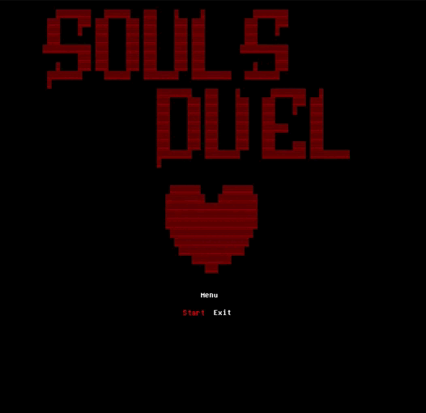
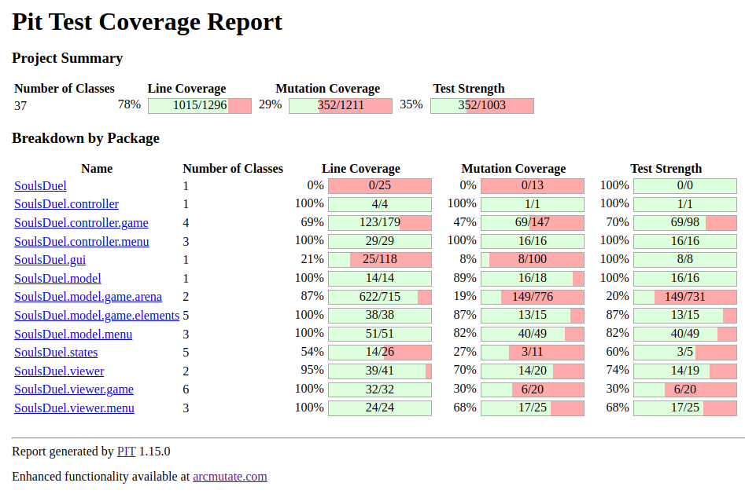

# 
Soul's Duel

## 
LDTS

### 
Project - l14gr09

This project was developed by *João Rey*(up202205576@fe.up.pt) and *Antero Morgado*(up202204971@fe.up.pt) for the curricular unity LDTS 2023/24.

Embark on an epic adventure in "Soul's Duel," a 2D game inspired by the intense battles of Undertale. Assume the role of a courageous soul navigating a mysterious world filled with challenges and adversaries. Engage in thrilling battles where strategic decisions and quick reflexes are key to survival. Face formidable enemies, each with unique abilities, and navigate through their attacks to emerge victorious. Dive into intense battles and determine the fate of your soul.

------

### IMPLEMENTED FEATURES

- **Move** - The game character can be controlled using the arrow keys keys.
- **HP** - The player has health points.
- **Get hit** - If the character gets hit, he will lose Health Points (HP).
- **Enemies** - An area displays enemies in an ASCII design.
- **Different attacks** - Enemies have various combinations of attacks.
- **Menu** - The game includes a menu with a play option.
- **Music** - There is music in the menus and in-game, along with hit sound effects.
- **Skin** - The hero is not represented by a letter; using FontForge, we crafted their appearance as a heart.
- **Levels** - Players can experience four different levels.

  

  <b><i>Fig 1. First Seconds </i></b>

As inspiration and illustration (Mockup), here are GIFs of two Undertale fights:

  

  <b><i>Fig 2. Undertale Fight with Sans (Mockup)</i></b>

  

  <b><i>Fig 3. Undertale Fight with Toriel (Mockup)</i></b>

------

### Model-View-Controller (MVC) Pattern

**Structured Architecture for Enhanced Application Management**

In our game development, we aimed to establish a robust architecture that promotes maintainability, scalability, and separation of concerns. The Model-View-Controller (MVC) pattern became instrumental in achieving these goals by dividing the application into three interconnected components.

**The MVC Pattern for Application Organization**

Recognizing the importance of managing data (Model), user interface (View), and user input (Controller) separately, we adopted the MVC pattern to create a well-structured foundation for our application.

**Implementation**

The following diagram illustrates how the MVC pattern is implemented in our application:

  

  <b><i>Fig 4. UML representing the MVC pattern (and more)</i></b>

- Model: Represents the data and business logic of the application. It stores and manages the application state, ensuring data integrity and consistency.

- View: Manages the presentation and user interface elements. It receives updates from the Model and displays the information to the user. Multiple views can be created to represent the same data differently.

- Controller: Handles user input and communicates with both the Model and View. It interprets user actions, updates the Model accordingly, and triggers the necessary changes in the View.

**Consequences**

Implementing the MVC pattern in our application architecture has yielded several advantages:
- Separation of Concerns: The MVC pattern promotes a clear separation between data management, user interface, and user input handling. This separation facilitates easier maintenance and updates to specific components without affecting others.
- Code Reusability: Components of the MVC pattern are modular, allowing for code reuse across different parts of the application. For instance, a View designed for one feature can be reused with a different Model or Controller.
- Scalability: The modular nature of MVC makes it easier to scale the application. Additional features can be integrated by extending or creating new Models, Views, and Controllers without impacting the existing codebase.
- Testability: Each component (Model, View, and Controller) can be tested independently, simplifying the testing process and ensuring the reliability of the overall application.
- Enhanced Collaboration: MVC fosters collaboration among developers by providing a well-defined structure. Developers can work on specific components without interfering with others, promoting efficient collaboration in larger development teams.

### States

**Managing Different States in the Game**

In our game, we aimed to introduce a diverse set of experiences by incorporating distinct states. The primary focus was on creating a menu that offers various options, including initiating gameplay.

**The State Pattern for Managing Different Game States**

In our game development, we recognized the need for managing distinct states such as the main menu and the gameplay itself. To facilitate this, we implemented the State pattern, providing a structured approach to represent and transition between various states within our application.

**Implementation**

This figure can ilustrate how the pattern were mapped to the application classes:

  

  <b><i>Fig 5. UML screenshot of the State pattern</i></b>

**Consequences**

The use of the State pattern in our game design brings several benefits:
- Organized Code Structure: The State pattern enables a clean and organized codebase by encapsulating the behavior of each state within separate classes.
- Flexible State Transitions: Dynamic state transitions are achieved through the setState() method, providing flexibility in managing different game states.
- Modular and Extensible: Adding new states becomes a modular process, and the system is easily extensible without modifying existing code.
- Improved Readability: The State pattern enhances code readability by isolating the logic associated with each state, making it easier to understand and maintain.

### Game Loop

**Make the game work**

We encountered a critical challenge related to the continuous and synchronized execution of the game logic. Without a structured approach to manage the dynamic nature of gameplay, we faced difficulties in maintaining consistent interactions between the model, controller, and viewer components. So we decided to implement the **Game Loop** as sugested by the teacher.

**The Game Loop Pattern**

We've incorporated the **Game Loop** pattern into our application, aligning with the Model-Controller-Viewer architecture. This pattern orchestrates the continuous execution of the game logic, providing a structured and synchronized flow between the model, controller, and viewer components.

**Implementation**

This figure can ilustrate how the pattern were mapped to the application classes:

  

  <b><i>Fig 6. UML screenshot of the Game Loop</i></b>

**Consequences**

The integration of the Game Loop pattern into our Model-Controller-Viewer architecture yields several advantages:

- Consistent Game Logic Execution: The Game Loop ensures a steady and consistent execution of the game logic, promoting smooth gameplay experiences.
- Separation of Concerns: The Model-Controller-Viewer architecture remains well-defined, with the game loop acting as the orchestrator, keeping the concerns of the model, controller, and viewer separate.
- Real-time Responsiveness: By controlling the update interval, the application remains responsive in real-time, adapting to changes in the game state.
- Predictable Rendering: The synchronized game loop provides predictability in rendering frames, enhancing visual stability and reducing potential glitches.
- Dynamic Adaptability: The ability to dynamically adjust the loop's update interval allows us to optimize performance based on the application's requirements.

### Factory Method

**Utilizing the Factory Method Pattern for Controller and Viewer Instances in Different States:**

Within our game development, we recognized the need for dynamic instantiation of controllers and viewers based on the current game state. To address this, we employed the Factory Method pattern, allowing us to encapsulate the creation logic of these components within dedicated factory methods.

**Implementation**

This illustration demonstrates how the Factory Method pattern is applied in our application:

  

  <b><i>Fig 7. UML screenshot of the Factory Method pattern</i></b>

**Consequences**

Applying the Factory Method pattern to our controller and viewer instantiation offers several advantages:
- Decoupling: The creation logic for controllers and viewers is decoupled from the Game class, enhancing flexibility and maintainability.
- Extensibility: Introducing new states and corresponding controllers/viewers becomes a modular process without affecting existing code.
- State-specific Implementations: Each state can have its own implementation of controller and viewer creation, tailoring the components to specific state requirements.
- Encapsulation: The Factory Method pattern encapsulates the instantiation details, promoting a cleaner and more organized structure.

------

### 
Classes Diagram

  

  <b><i>Fig 8. Classes Diagram from IntelliJ</i></b>

------

## ConcurrentModificationException

While developing the game, we encountered an issue related to the 
ConcurrentModificationException. This exception occurred when 
attempting to modify (add values) to a List while iterating through it in a 
for loop. Resolving this problem took some time as we explored various approaches, 
including synchronizing the Lists and iterating using pointers. 
Ultimately, we found success by copying the List and then iterating through the copied version.

------

## KNOWN CODE SMELLS

### Strategy Pattern instead of Switch

In the implementation of blade and grenade movement, a switch
case has been employed, inadvertently violating several SOLID
principles. Specifically, the code exhibits issues related to
the Single Responsibility Principle (SRP), Open/Closed Principle
(OCP), and Dependency Inversion Principle (DIP).

To address these concerns and enhance the codebase, a
possible improvement is the adoption of a **Strategy pattern**.
This design pattern facilitates the encapsulation of different
movement strategies into separate classes, aligning with the
OCP by allowing for easy extension without modifying existing
code. Furthermore, the Strategy pattern promotes adherence to
the SRP by segregating responsibilities and facilitates
adherence to the DIP by introducing abstraction and reducing
tight coupling.

Implementing a Strategy pattern for moving strategies would
not only mitigate the current violations but also contribute
to a more modular, maintainable, and extensible codebase.

### GUI smells

The current implementation exhibits a code smell related to
the direct embedding of ASCII art representing images within
the methods, thereby violating the Open/Closed Principle
(OCP). This practice requires code modification each time
an image change is necessary, contradicting the principle's
goal of facilitating easy extension without altering existing code.

To address this issue, a possible improvement involves
implementing a dedicated file to store all ASCII art
representations. By externalizing the image content,
we adhere to the OCP and introduce a more flexible
and maintainable solution. This approach allows for
easy image modifications without the need to alter the
existing codebase.

Implementing a file that owns all the ASCII arts represents
a valid solution for several reasons. Firstly, it aligns
with the Open/Closed Principle by separating image representation
from the code logic, enabling easy extension without modifying
existing methods. Additionally, this approach promotes a more
modular and organized codebase, enhancing readability and
maintainability. It establishes a clear
separation of concerns, making it simpler
to manage and update images independently
of the application's core logic.

### Arena Builder, a BIG issue

The ArenaBuilder class, initially prioritizing functionality
over good programming practices, has grown excessively large,
violating key SOLID principles. Particularly, the class
currently exhibits a violation of the Single Responsibility
Principle (SRP) by taking on multiple responsibilities in single methods,
including creating game elements, scheduling events, and
initializing the arena. This lack of separation of concerns
hinders maintainability and adaptability.

While the initial development approach focused on making the
code work, the accumulated size and complexity of the ArenaBuilder
class now present challenges. The violation of the SRP not only impacts
the class's readability but also restricts its extensibility.

  

  <b><i>Fig 9. The ArenaBuilder Problem</i></b>

## 
TESTING

  

  <b><i>Fig 10. Code coverage screenshot</i></b>

  

  <b><i>Fig 11. First PITest page</i></b>

After a brief discussion with the Professor Daniel Fortunato, our team made a
concerted effort to enhance the test coverage of various classes, as depicted
in Fig. 11 compared to Fig. 10. The overarching goal was to achieve approximately
80% test coverage, but unfortunately, this target was not reached in the Game.java
and ArenaBuilder.java classes.
In the classes that improved coverage, the mutations that we killed were mostly
conditional negations and conditional boundary changed in for loops.

  

  <b><i>Fig 12. Last PITest page</i></b>

The Game.java class currently exhibits 0% mutation coverage and line coverage in Pitest.
This is primarily due to challenges associated with testing scenarios that involve opening
windows (in this case, Terminal). Attempts were made to mock the LanternaGui to prevent the
terminal from opening. However, given that LanternaGui is initialized in the Game constructor,
these efforts were not successful. Despite these obstacles, some tests have been included
in the GameTest.java file, although they are currently commented out.

The ArenaBuilder.java class has achieved lower percentages compared to other classes.
This discrepancy is attributed to the use of the Timer library from java.util and the
schedule method, which is employed to spawn elements at specific times in the arena for
creating a "temporal line" and levels.

The challenge arises from the schedule method, which dynamically defines a new
function with each invocation. Consequently, formulating exhaustive tests that
adequately cover these dynamically generated functions poses a difficulty. While
there might be potential strategies to address this testing challenge, we have
failed to explore or implement them at this time.

Most surviving mutation tests in ArenaBuilder involve the removal of calls to ArenaBuilder's scheduling methods
("1. removed call to ArenaBuilder::SchedulingMethod → SURVIVED").

In the End we ended up getting the following coverage in IntelliJ (with the GameTest.java not commented):

  

  <b><i>Fig 13. Last Coverage</i></b>

### SELF-EVALUATION

- Antero Morgado: 50%
- João Rey: 50%
